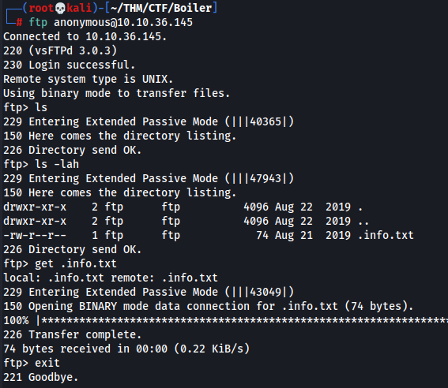
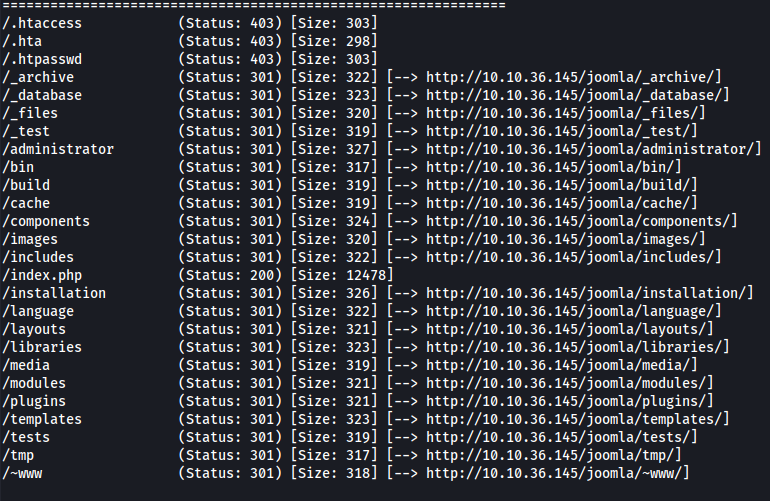
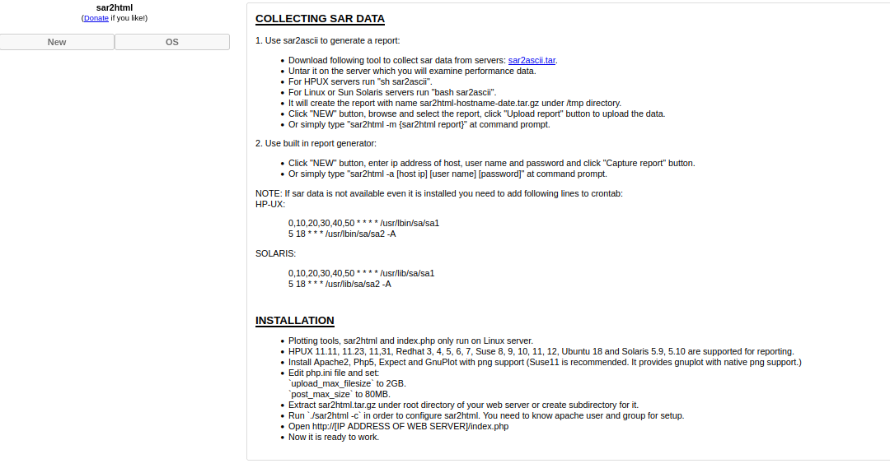
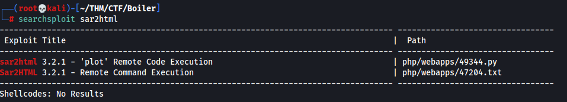
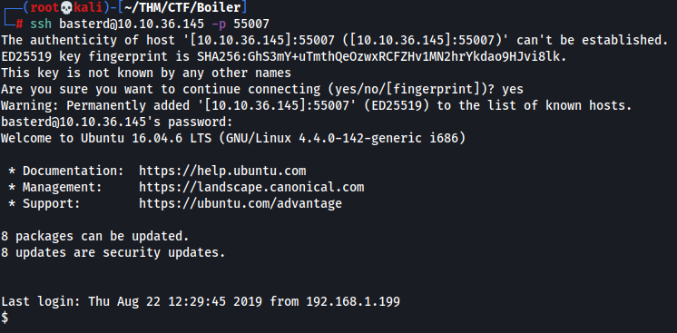
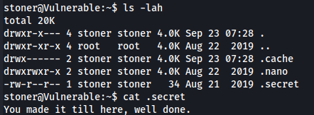
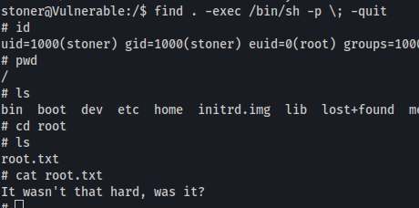

# Boiler CTF - THM Room

##### Gnome787 | 23 SEP 22

##### Creds

* ssh - basterd:superduperp@$$
* ssh - stoner:superduperp@$$no1knows

### Enum

**NMAP**
```bash
┌──(root💀kali)-[~/THM/CTF/Boiler]
└─# nmap -sC -sV 10.10.36.145 -oN nmap/initial                    
Starting Nmap 7.92 ( https://nmap.org ) at 2022-09-22 22:55 EDT
```

Open Ports:
* 21 FTP
* 80 HTTP
* 10000 HTTP MiniServ

I also ran a deep scan once the initial scan was done, and found the following:
```bash
┌──(root💀kali)-[~/THM/CTF/Boiler]
└─# nmap -A -v -p- --min-rate=1000 10.10.36.145 -oN nmap/deep 
Starting Nmap 7.92 ( https://nmap.org ) at 2022-09-22 22:58 EDT
```

Open ports:
* 55007 ssh

**Gobuster**
```bash
──(root💀kali)-[~/THM/CTF/Boiler]
└─# gobuster dir -w /usr/share/seclists/Discovery/Web-Content/common.txt -u http://10.10.36.145                    
===============================================================
Gobuster v3.1.0
by OJ Reeves (@TheColonial) & Christian Mehlmauer (@firefart)
===============================================================
```

Found a number of directories, the ones of interest are:
* /joomla
* /manual

**21 FTP**
Anonymous login worked but didn't find anything on the server immediately. After some research, I found that the command ```ls -lah``` can be used to return files that are hidden due to a ```.``` being at the front of their name.


Taking a look at the fille gives me the following:
```
Whfg jnagrq gb frr vs lbh svaq vg. Yby. Erzrzore: Rahzrengvba vf gur xrl!
```
This looks to me like a **ROT13** cipher. Using cyber chef we can decipher it.
```
Just wanted to see if you find it. Lol. Remember: Enumeration is the key!
```
Just another dead end.

**80 HTTP**
Simple apache page, not much going on. 
* robots.txt - There was a hex dump and a number of directories that didn't really seem to lead anywhere.
* joomla - This looks pretty interesting, definately want to explore it further.

**10000 Webmin**
I attempted some default credentials, no luck. Could try and bruteforce but with no confirmed username I figure I might leave it for the time being and see what joomla has to offer.

**Joomla**
I started off by running another gobuster scan to see what directories joomla holds:
```bash
┌──(root💀kali)-[~/THM/CTF/Boiler]
└─# gobuster dir -w /usr/share/seclists/Discovery/Web-Content/common.txt -u http://10.10.36.145/joomla/
===============================================================
Gobuster v3.1.0
by OJ Reeves (@TheColonial) & Christian Mehlmauer (@firefart)
===============================================================
```
Turns out to be a lot of them.



I spent a lot of time looking through these directories, initially I had a look at the administrator, and ended up going down a rabbit hole, attempting to use a SQLi exploit that would not work. I decided then to take another look at my gobuster output, and had looked at the **_files**, **_test**, and **_archive**. The directory of most interest to me was **_files** as it seemed to have some base64 on the page. Decoding this gives me "Whopsie daisy". Not exactly helpful, from there I looked at **_test**. This gave me an interesting page:

**Joomla Rabbithole**
I wanted to add this in as I spent a decent amount of time looking at this. When going through joomla, I had a look online for enumerating joomla guides. I came across one that led me to the page /administrator/components on joomla. I spent a long time looking through there and eventually began to use a tool named **JoomlaVS** to enumerate. It found an SQLi RCE vuln at /joomla/administrator/components/com_fields/fields.xml which I tried to use.

**Sar2html**


From here I used searchsploit to see if there are any exploits for this particular service:



Taking a look at the text file, it says that we can run commands on the remote machine by using the url ```http://10.10.36.145/joomla/_test/index.php?plot=;command```. Then we click the **Select host** and our command output is at the bottom.

I started off by just trying to get a reverse shell, this didn't work, even url encoding the command wouldn't get me there. So I just decided to start enumerating the system. Seeing what files are available.

There is a file named **log.txt** which seems to contain a username and password for ssh. Using the username and password we got, we are able to login to ssh.

**55007 SSH**


Once I got access I ran a simple python 1-liner to get a prompt and make tabbing work, then ran an ```ls -lah```. This uncovered a file named backup.sh which in it, contained the credentials for the user stoner.

Once in stoners account, I was able  to get the user flag:



## Priv ESC

Now that we have the user flag and a connection to the remote host, we can start to priv esc. First I ran the command:
```bash
sudo -l
```
This return one result but the name suggested it was just a taunt **/NotThisTime/MessinWithYa**

From there I ran:
```bash
find / -type f -perm -04000 -ls 2>/dev/null
```
This returned some results, interestingly I noticed **find** was in there. From experience, the presence of find is usually a good sign for a priv esc. Quick look at **GTFOBins** shows that we exploit the fact find has the SUID bit set by doing:
```bash
find . -exec /bin/sh -p \; -quit
```
Running this command, we are able to get root:



### Things learned

* Enumerate, enumerate, enumerate. I did get lost down some rabbitholes at different points, however, its always worth seeing if you have a potential way in or not before closing the book on it too early.
* Searchsploit every service you come across. At first I didn't even think to look into Sar2html so always check, especially if its a service you don't come across often like Sar2html.
* When presented with a long list of directories, if any stand out like _test or _archive or _files, make sure to look at then. It was only at the end that I looked into those pages properly.
* Using ```ls -lah``` if at first there is not files in a directory, such as when you first get into an ftp server.


