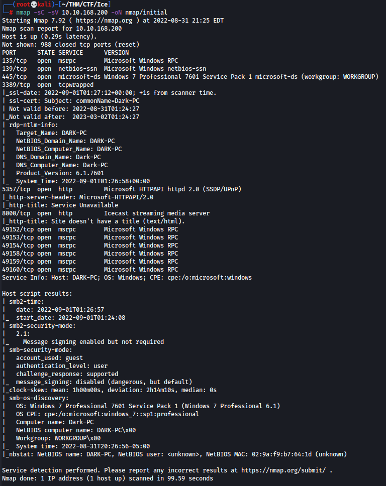
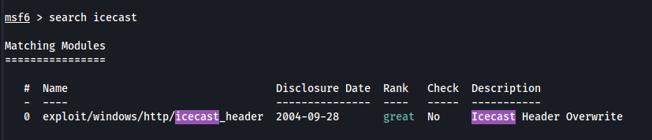
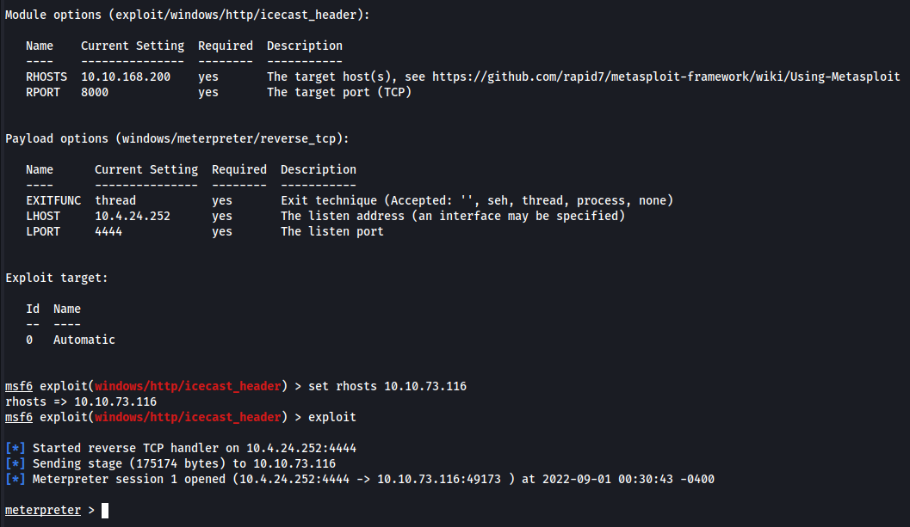
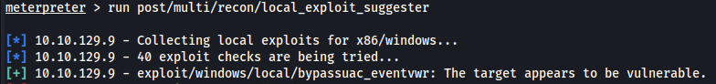
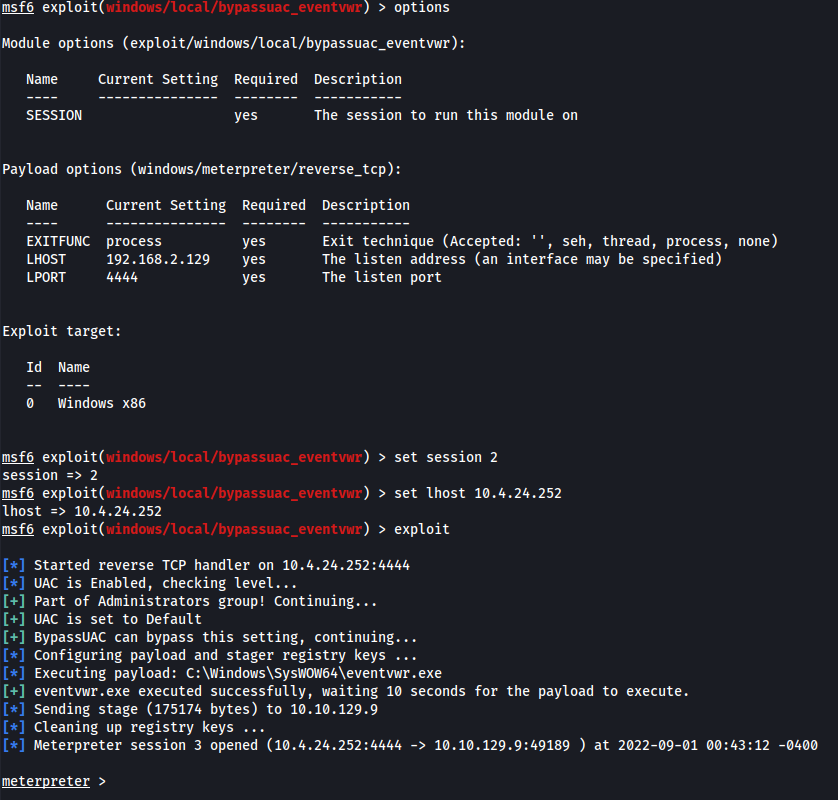
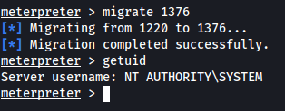
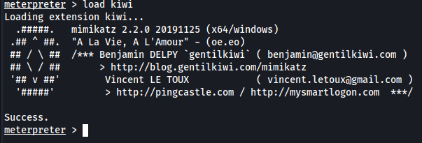
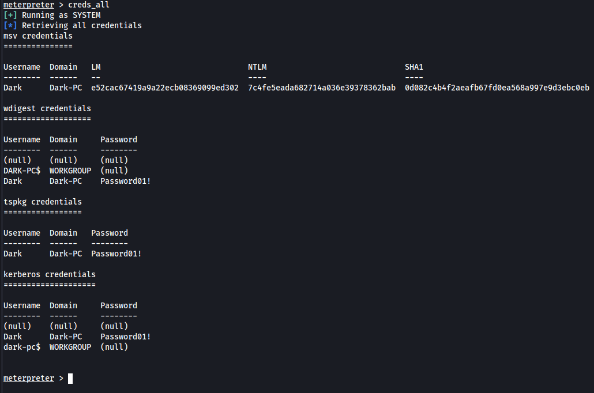

# ICE - THM Room

##### Gnome787 | 01 SEP 22

### Credentials

Dark:Password01!

### Enumeration

We begin our attack with an nmap scan like so.

This gives us the answers to our first few questions as well as a lot of places to begin our attack.

Following along with the room **Tasks** we will have a look at the process running on port **8000** being **Icecast**. Having a look on [CVE Details](https://www.cvedetails.com/vulnerability-list/vendor_id-693/Icecast.html) we find a **Execute Code Overflow** vulnerability we can utilise to exploit our target machine with a CVE of **CVE-2004-1561**. Before I went down the metasploit route I attempted to get one of the exploits that can be found on exploitdb working but couldn't seem to get a reverse shell. Likely a problem with the shellcode not downloading netcat onto the system but as I know very little about shellcode this is an avenue I may revisit when I am more knowlegable on the topic. 

From here I had a look for icecast exploits in metasploit and found the following.

Set my options like so, and ran the exploit which gave us a meterpreter shell.

After having to restart the machine and redo the exploit as every command I ran would time out, I finally was able to start enumerate the machine.

### Priv Esc

Now that we have access to the machine, we can start to look at escalating those privileges to administrator level privileges.

One of the things that makes a meterpreter shell so useful is all the post exploit functions that can be utilised. For example this one **run post/multi/recon/local_exploit_suggester** will find potential exploits on the machine we can use to escalate our privileges. The first result returned is **exploit/windows/local/bypassuac_eventvwr** which we will use.

As usual we set the options as required and then run our exploit. This generates a new session where we have the permission **SeTakeOwnershipPrivilege** which let's us take control over files.

### Looting

We want to migrate to a process that has the same architecture **x64** and permissions as **lsass.exe**. This is **spoolsv.exe**, which will allow us to interact with lsass.exe and dump some credentials. We can migrate to this process and take on the **System** user.

From there we can run the command **load kiwi** which will load **Mimikatz** a fairly infamous password dumping tool. 

From there, if we run the command **help** we get a number of new commands specifically for interacting with Mimikatz. We can run the command **creds_all** which does pretty much what it says. 

### Post Exploitation

Lastly, there are a number of things we can do after owning a system using a meterpreter shell. For example:
* Dump all the password hashes: hashdump
* Watch the remote desktop: screenshare
* Record the microphone: record_mic
* Modify timestamps: timestomp
* Allow for easy authentication anywhere: golden_ticket_create
* Enable RDP if it isn't alread: run post/windows/manage/enable_rdp