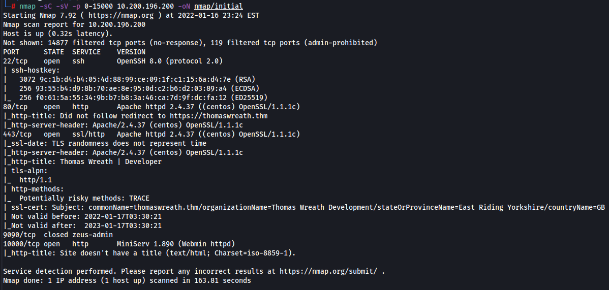
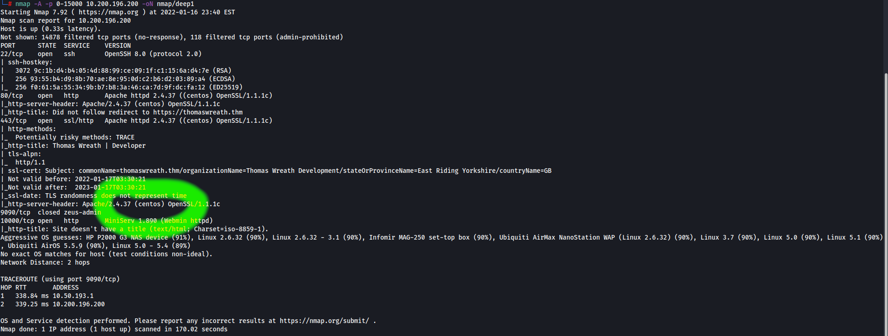

# Enumeration

To begin with, we will run a basic nmap scan of the first 15000 ports using the following command
 - **nmap -sC -sV -p 0-15000 10.200.196.200 -oN nmap/initial**

From this we get the following output:

This gives us the answer to our first question of how many open ports there are. There are **'4'**

From here I also ran a scan to detect the OS which you can see in the scan is 'centos'
- **nmap -A -p 0-15000 10.200.196.200 -oN nmap/deep1**

An alternate way you could get this OS info is by looking at the web request headers

From here we can take a look at the site making sure to add the machines IP and **'thomaswreath.thm'** to our /etc/hosts file 

Next we want to find the mobile number of our target. This is found by scrolling through the index page on the site

Next we are looking for the version of server that is run on this system. Taking a look at our nmap scan and we see **'MiniServ 1.890 (Webmin httpd)'**

A quick google search returns the CVE number for an exploit that works with this particular version of MiniServ: **CVE-2019-15107**

