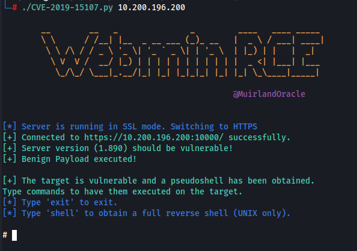
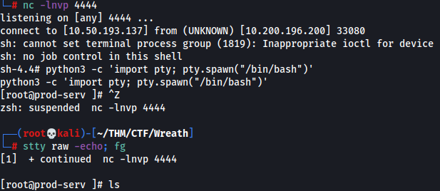
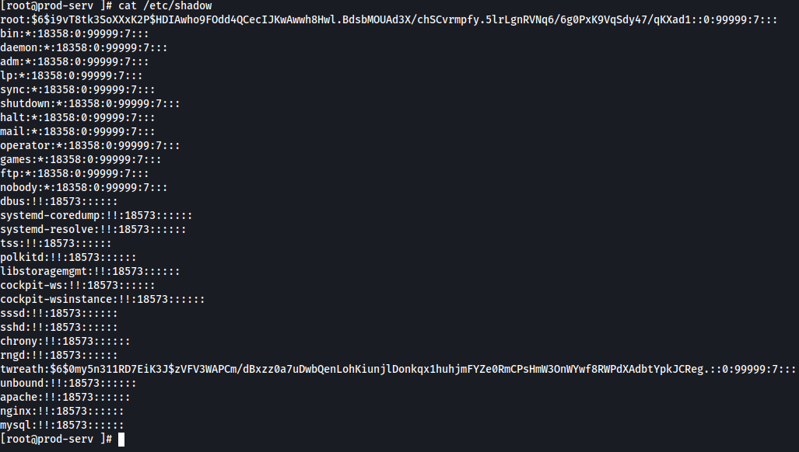
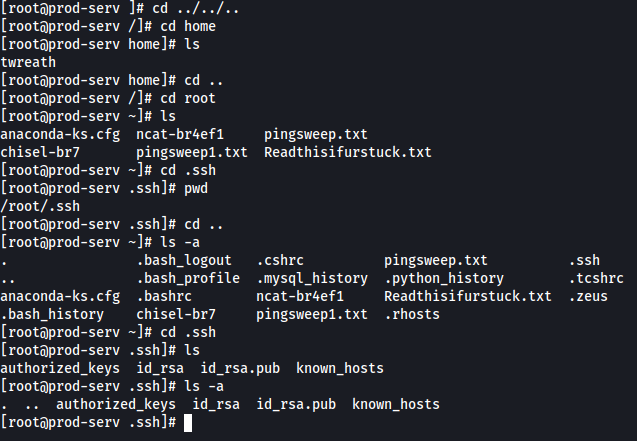

# Exploitation

Now that we have our vulnerability **(CVE-2019-15107)**, we can start the exploitation process using a exploit that utilises this particular vulnerability

We simply download the exploit file, install the necessary requirements and then run it against the vulnerable machine

As you can see from this screenshot we now have a shell on the machine we can use to start enumerating the machine

Using the command id we can see that we are the **'root'** user

This exploit only generated a pseudoshell however, it does allow us to get a proper reverse shell simply by entering the command **shell**, inputing our openvpn IP & a port and then starting a nc listener on that port. This works and we now have a shell. We want to stabalise this shell. 

From here we want to find the root users password hash which we can do by running **'cat /etc/shadow'**

We know we can't crack this however, if we can find an ssh key file it would give us persistent access to the server as root through ssh which we know is running from our earlier nmap scans.

These keys are usually found in a folder named /.ssh and can often be found inside the home directory of the user for which they are for. We head to the root folder and do **'ls -a'** as the folder won't show up with a simple **'ls'** command. From here we enter the .ssh folder and grab the id_rsa file which contains the private key for the root users ssh access. From here I grabbed the key, ran the command **'chmod 600 id_rsa'** on the file and accessed the server as root through ssh

**NOTE: When trying to ssh in I ran into an issue that prevented me from joining the server. SSH keys require a new line at the end of them and due to the fact I copied and pasted the key from the machine and forgot to add this new line, I wasn't able to access the machine.**

