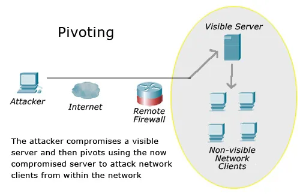

# What is Pivoting?

In terms of network penetration, pivoting is using one machine on a network that you already have access to, as a means to further access other machines on that network that aren't public facing and therefore can not be easily accessed in the way a public facing machine can be

The best example of this would be to gain access via a web server. This would involve penetrating the web application and gaining access to the server that hosts that web app. From there you would enumerate the network that the system is on from the compromised system and then set about exploiting any systems that are also on this network

*Image Source: http://danscourses.com/metasploit-pivoting/*

