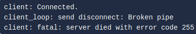

# sshuttle

This tool works quite differently to our other pivoting tools that we have explored thus far. Essentially it simulates a VPN, allowing us to route our traffic through the proxy without the use of tools like proxychains. Instead we can connect devices directly into the target network as any normal device would be. One major benefit of this method is that due to it creating a tunnel through SSH, all traffic that travels through it is encrypted. We use sshuttle entirely on our attacking machine, in much the same way we would SSH into a remote server. 

A downside to this approach however, is that it only works with linux targets and requires access to the compromised system via SSH. It also requires python to be installed on the system however, this can be fixed by uploading a python static binary if you already have access. These restrictions do hamper it's ability to be used, however, when it can be used it is a very effective tool

### Usage

To install this tool on Kali, simply run: **sudo apt install sshuttle**

Connecting to a server can be done like so: **sshuttle -r username@address subnet**. Of note is that instead of inputting the subnet, you can use the **-N** switch to have sshuttle try and determine the subnet itself

Back to our example network, say we wanted to connect to our compromised server at **172.16.0.5**, we could do the following: **sshuttle -r user@172.16.0.5 172.16.0.0/24**

Once we input our command, we are prompted for the users password and then the proxy is established, forwarding any relevant traffic into the network as the tool sits passively in the background

### Potential Error Encounters

In some cases we may not have the users password or the server may require key-based authentication. In such a case we can use **--ssh-cmd** to specify what command gets executed by sshuttle when trying to authenticate with the compromised server. The command for a key-based authentication would look like: **sshuttle -r user@address --ssh-cmd "ssh -i KEYFILE" SUBNET**. In the context of our example network, this would look like: **sshuttle -r user@172.16.0.5 --ssh-cmd "ssh -i private_key" 172.16.0.0/24**

Another error that may be encountered when using sshuttle is something that looks like the following:

This occurs when you are trying to compromise a system that is on the same subnet as the machine you have already compromised. In our example, we would be trying to compromise **172.16.0.0/24** using our compromised system **172.16.0.5** which is on the same subnet therefore throughing this error when we try to connect with sshuttle. To get around this we can use the **-x** switch followed by the compromised systems IP to tell sshuttle that we wan't to exclude that from the subnet range: **sshuttle -r user@172.16.0.5 172.16.0.0/24 -x 172.16.0.5**

Doing this we get a connection that won't disrupt itself

