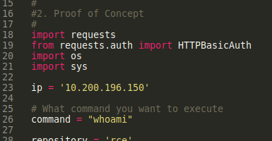
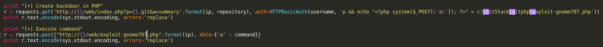

# Code Review

Now that we have our exploit, we can copy it by doing the following: **searchsploit -m 43777**

Now we have it in our working directory we need to convert the DOS line endings into Linux line endings. We can do this with a tool named **dos2unix**. In our case we would do **dos2unix ./43777.py**

Now that we have our converted exploit, we need to take a look at the code and ensure that it will work. We also must see which version of python it was created for. Older exploits are often written in python2 and therefore don't work with python3

Our exploit is fairly right to go, other then needing to change the IP address to our target box and adjust the name of the exploit file that is created so as not to effect what other users of the network are doing

