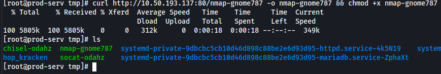
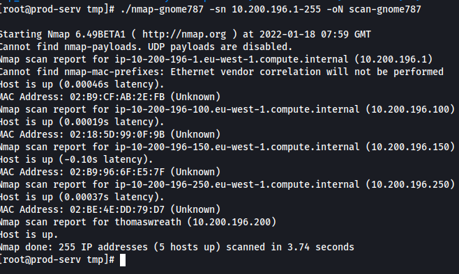
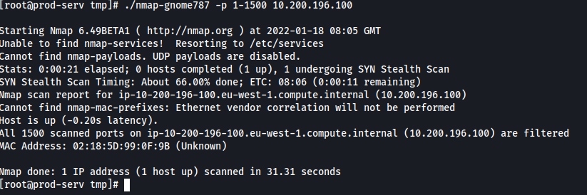
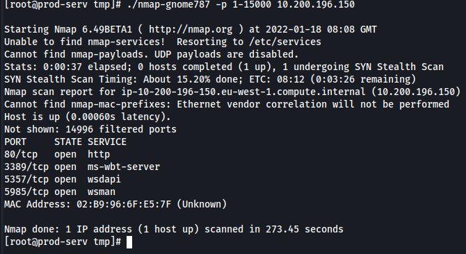

# Enumeration

Now that we have SSH access to a machine on the network and new found information regarding pivoting on a network to access other machines on that network

We start by downloading an nmap binary [Download Here.](https://github.com/andrew-d/static-binaries/blob/master/binaries/linux/x86_64/nmap?raw=true) After we have that we can host a web server on our attacking machine with the following command **sudo python3 -m http.server 80** which we can host our binary on. From here we can curl our nmap binary from our web server onto the compromised machine and from here make it an executable: **chmod +x nmap-gnome787**

Now that we have our binary on the system, we can start to use it to scan the network and try to discover more systems

For our scan we just want to discover any other systems on the machine so we can do a simple ping scan and we may want this data later so it's good to output it to a file. The following command will do just fine: **./nmap-gnome787 -sn 10.200.196.1-255 -oN scan-gnome787**

After running the scan we get a return on some hosts. We know that the systems whose last octet is **.1** and **.250** are outside the scope but we have 2 other hosts found on **.100** and **.150**

Now we wanna scan these hosts starting with **10.200.196.100**:

We see all ports are filtered. From here we also wanna scan **10.200.196.150**:

We see now we actually have something to work with. We know **5357** is out of scope so we can stick to the other 3 ports being **80**, **3389** and **5985** to try and see if we can access this system

Looking at this, we are probably going to have the most luck finding an exploit in the **http** service