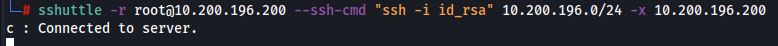
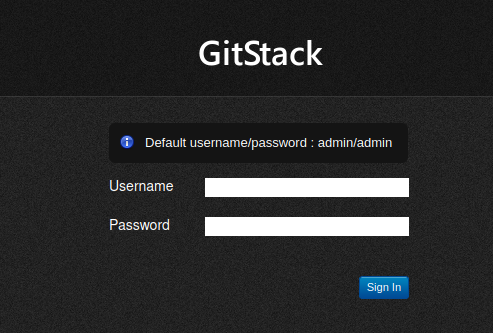
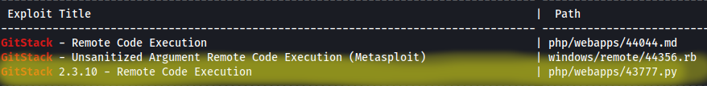

# Pivoting

Now that we have our host 10.200.196.150, and some potential services to exploit **80 http**, **3389 ms-wbt-server** and **5985 wsman**, we can begin our exploitation attempt

We wanna begin by using sshuttle so we can access the website that is hosted on our newly found host.

In my case I used the following command to establish a connection I can use to pivot from: **sshuttle -r root@10.200.196.200 --ssh-cmd "ssh -i id_rsa" 10.200.196.0/24 -x 10.200.196.200**

Now we can head to our server **10.200.196.150** and we are met with an error page

Interestingly, we see the error page makes reference to some URL patterns. Trying to access them and we see that **/gitstack** takes us to a login page

Unfortunately, the default credentials don't work however, if we do a search using searchsploit, we may find an exploit for this service

Searchsploit returned some options, the one we are interested is highlight. Exploit 43777 on exploit db

