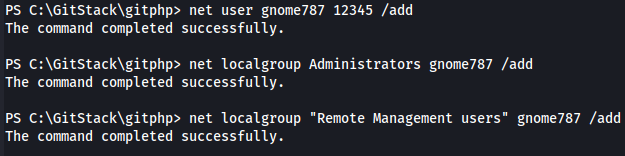
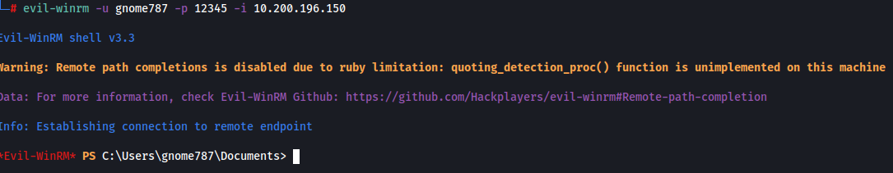
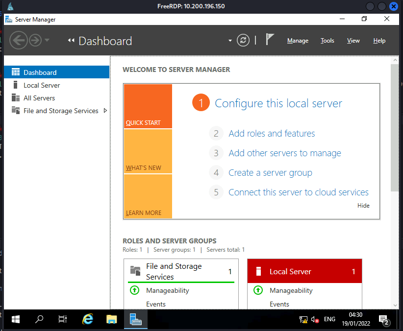
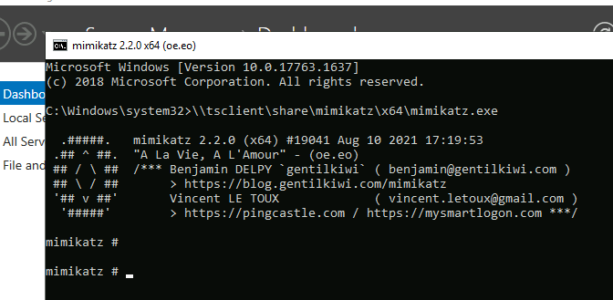
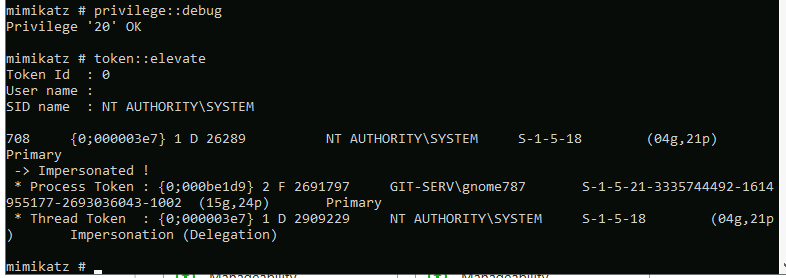
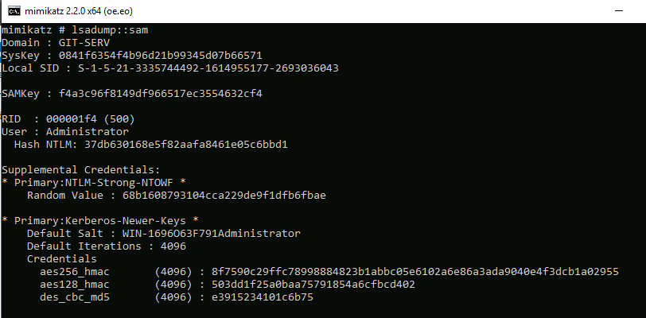
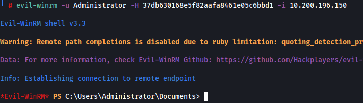

# Stabilisation & Post Exploitation

Now that we have our shell access to the machine, we want to see about getting a more permanent route to accessing this machine. We should be able to get a more stable acces using RDP through port 3389 or getting a stable CLI shell using WinRM through port 5985

As it is, if we desire to get a shell with our access, it requries us to ssh into our original compromised system, startup netcat, and launch our payload (this is exactly what I just had to do given it is the next day to when I got the initial shell). Whilst this isn't difficult, it is unecessary when we can simply create an administrator account that can use RDP and is apart of the "Remote Management Users"

Given that we already have root equivalent access to this system, we can use this to create our administrator account

Now that we have this access we can both RDP in and using Evil-WinRM (which is a pretty incredible tool) to gain access whenever we want using that account we just made

Now instead of having to launch our netcat session on the .200 host and send our powershell reverse shell payload, we can just login using this awesome tool

We can use use xfreerdp to gain access to the machine using RDP which obviously gives us a GUI view of the box. This tool also provides a number of useful functionalities. These include:
- /dynamic-resolution -- This allows us to adjust the size of the RDP window
- +clipboard -- Enables clipboard support
- /drive:LOCAL_DIRECTORY,SHARENAME -- This allows us to create a shared drive between the attacking and target machine. This means we can easily use our tools on the target machine which we can use to further enumerate and exploit the system and network and then very easily save any outputs to our attacking machine. A major benefit with this is that we never have to create any files on the target machine. This shared drive on the system can be accessed in cmd by doing \\tsclient\ or through the file explorer under **This PC**

A useful directory to share is the /usr/share/windows-resources directory on Kali as this shares most of the Windows tools stockpiled on Kali, including Mimikatz which is an extremely powerful tool we will be using on our target next

So, now that we know how we can use xfreerdp, lets create a command that will connect to the target using our admin account we created, enable dynamic resolution and clipboard support and create a shared drive that is mapped to the **/usr/share/windows-resources** directory on our attacking machine: **xfreerdp /v:10.200.196.150 /u:gnome787 /p:12345 +clipboard /dynamic-resolution /drive:/usr/share/windows-resources,share**

Now that we have RDP access, we can navigate to our share we made and grab mimikatz so that we can do some further exploitation

We can do this all from the command line through our RDP session. First we wanna boot up **cmd.exe** as admin. From there we wanna navigate to mimikatz on our shared drive. This can be done by entering the following command: **\\tsclient\share\mimikatz\x64\mimikatz.exe**

Now that we have our mimikatz loaded, we want to first give ourselves debugging privileges and then elevate our integrity to SYSTEM level. The reason we do this is that many mimikatz commands require one of these to be able to run. We can do this by running the commands: **privilege::debug** and **token::elevate**

Now that we have elevated our privileges, we can use mimikatz to dump all the local account credentials. This can be done with the command: **lsadump::sam**

We have the Administrator hash: 37db630168e5f82aafa8461e05c6bbd1
We also have the NTLM hash for Thomas: 02d90eda8f6b6b06c32d5f207831101f

We know from the THM room that we can't crack the Administrator hash but we can crack the has for Thomas. Whilst we could boot into hashcat it's always worth putting it through crackstation as you may get lucky. This is not what you would do if you were doing this with a clients hash as that hash then gets stored on the site

We crack the hash and we get **i<3ruby**

One awesome feature of Evil-WinRM is the pass-the-hash functionality it hash. What this allows us as the attacker to do is, instead of trying to crack the password hash we got for our Administrator account, we simply change our **-p** switch to a **-H** switch and paste in our hash. This will then log us in as the Administrator account. In our case this is very beneficial as once the network resets, the admin account we created gets deleted. Our command will look like: **eviln-winrm -u Administrator -H 37db630168e5f82aafa8461e05c6bbd1 -i 10.200.196.150**

