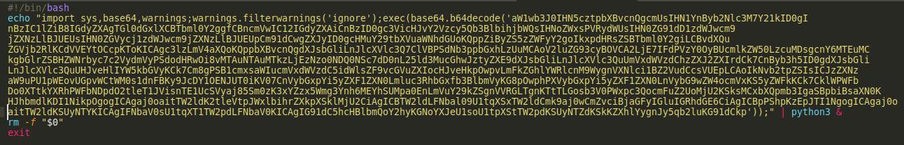
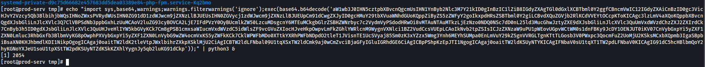
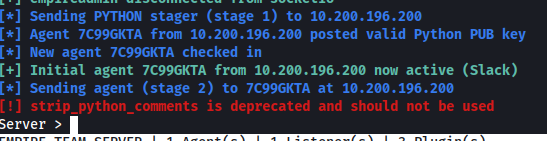
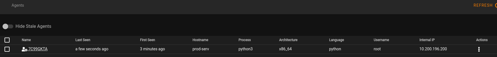

# Empire: Agents

Now that we have created our listener and stager, we can combine them to create an **Agent**

We can start by copying our payload from the **Stagers** module on our Starkiller session

Now that we have our payload, we can upload it to the target machine. Alternatively we can copy the section in the **echo** command aswell as the **| python3 &** part and paste it in the terminal on our compromised machine

We use our payload against the 10.200.196.200 machine through our ssh access like so:

And our Empire server recieves our agent

We can now navigate to our agents section of our Starkiller interface and we can see that our agent is listed

From here we can utilise a number of features such as the ability to execute commands in an interactive shell, browse the file system and execute modules. The actions menu also has a feature called **Pop Out** which creates a standalone window allowing us to utilise these features

Now that we have run through the setting up and interacting with Agents, we can delete our webserver agent and look at proxying Empire agents

