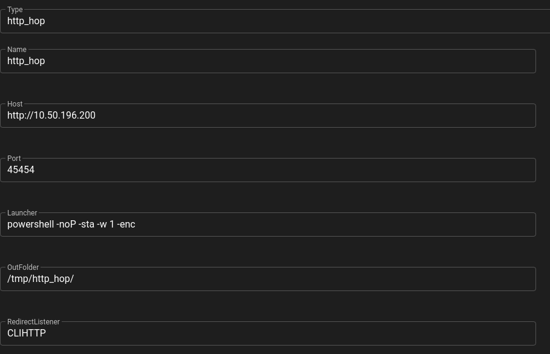

# Hop Listeners

Empire agent's can't be proxied with a socat relay or any equivalent redirects, therefore we must use a different method to get an agent back from our target which has no outbound access

For this, we can use a **Hop Listener**

A hop listener works by creating a number of files to be copied across to the compromised "jump" server. These files are setup to connect back to a normal listener on our attacking machine

We can setup a **Hop Listener** in the same **Listeners** section as we used when we created a standard **http** listener. For type we select **http.hop**, give it a name, set the **Host** to our **.200** host and set a port to have it listen on. We also want to set the **RedirectListener** to **CLIHTTP**. Once done, Empire will generate a number of **.php** files it will place in a folder name **http_hop** in the **/tmp** directory

