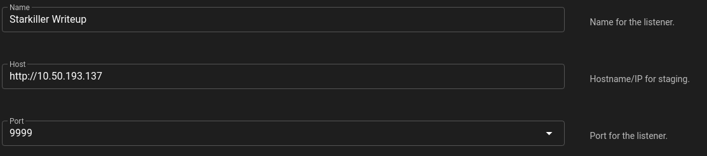

# Empire: Listeners

**Note:** The remainder of the writeup for Empire will be for Starkiller exclusively

Listeners are used in Empire to recieve connections from stagers. Listeners can of multiple types, hwoever, the default is a http listener.

### Creating a listener

Creaing a listener in Starkiller is very simple. Clicking the orange create button brings up a form with a drop down menu where we get to select the type of listener we want. Let's choose **http**. From here we can set our hosts IP (our attacking machine in this case) and set our port

