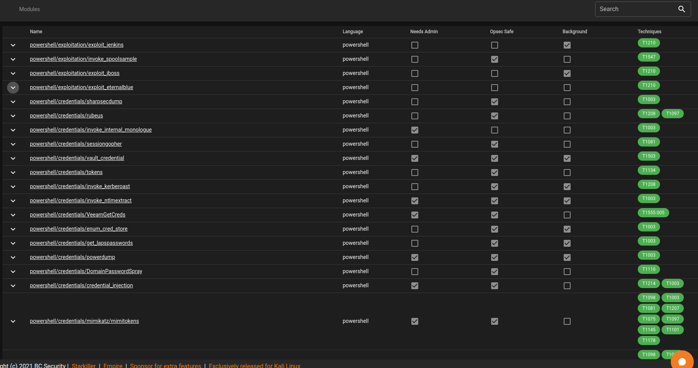

# Empire Modules

As identified earlier, Empire has a number of modules that allow the user to perform various tasks on their agents

If we head to the modules page, we see there is **398** different modules we could use. These includes mimikatz, sherlock (a tool to find local priv esc vulns) and even eternal blue. This is to just name a few

