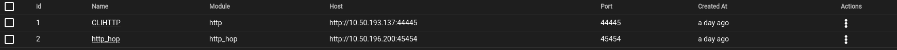
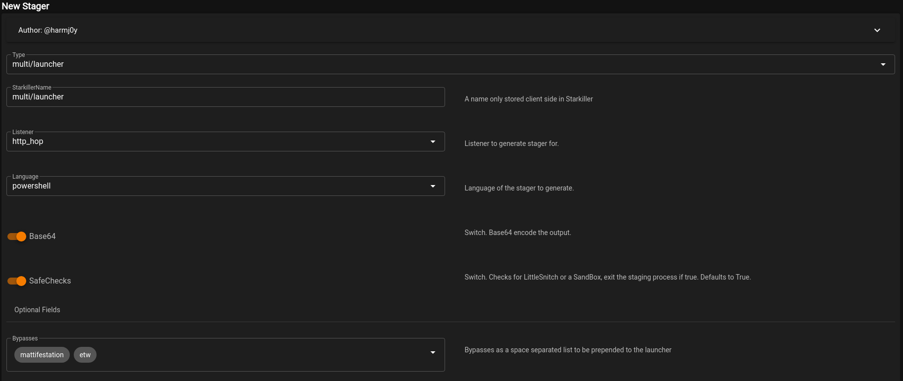
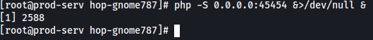

# Git Server

Now that we know how to use Empire and have our **Hop Listener** active, we can begin the process of getting an agent back from the Git Server

To do this we need to generate a stager for the target and put the **http_hop** files onto the **.200** host and serve them through a webserver on the port we select whilst creating the listener. For the webserver, we need php so a **PHP Debug** server will be an ideal choice

We need a couple things. To start with, we need to create a listener called **CLIHTTP** which will be set to our attacking machine. Then of course create our **Hop Listener** (if we haven't done so already) and set the **Redirect Listener** to our **CLIHTTP** listener

Now we have our listeners, we want to generate our **Stager**. In our case we want a **multi/launcher** stager and we will set it's listener as the **http_hop** listener

From here we can press the three dots under the **Actions** section of our stagers page and copy the payload to clipboard

Now we have our listeners setup and our stager created, we need to get our hop files onto our "jump" server. To do that we wanna ssh into our **.200** box and create a directory in the **/tmp** directory we can host our files in. In the case of my attack I will call my directory **hop-gnome787** and then **cd** into it

Now that we have our directory, we need to transfer our files from the **/tmp/http_hop** directory to our jump server. We can do this by zipping these files and then curling them onto the jump server and then of course, unzipping them

Now we need to serve our files on the port we set for our **http_hop** listener. In my case that is port **45454**. We can setup a PHP development webserver to serve our files, this can be done by doing the following **php -S 0.0.0.0:45454 &>/dev/null &**. Before we do that, its important to up the port on the firewall. This can be done by doing **firewall-cmd --zone=public --add-port 45454/tcp**

