# Malware Triage

The following static and dynamic malware analysis processes are compiled using a lab environment comprised of a Windows 10 VM and a Remnux VM both on a host-only network. The Remnux VM acting as a router with inetsim setup and the Windows 10 VM setup with the Remnux VM as the gateway and DNS server.

### Malware Triage Concepts

When it comes to dealing with malware, there are a number of concepts of which you need to be aware.

##### Obfuscation
One of the main goals of malware, aside from it inherent intended purpose, is to remain undetected for as long as possible. This includes alluding AV solutions as well as being difficult for malware researchers and IR teams to analyse and develop solutions that will mitigate the malware effectiveness. **Obfuscation** is used by malware authors to hide the intended purpose of their malware by making the code, and various other aspects of the binary that are used to identify its purpose, hard to analyse. Some examples of obfuscation include:
* **Encoding** - By converting the malware code to a different format, it makes it harder to analyse and aids in ensuring it remains undetected.
* **Packing** - Packing malware involves encrypting and/or compressing it. Packed malware is very difficult to analyse, and the more sophisticated malware authors will use their own custom built packers making it near impossible to statically analyse or dissassemble.

##### Entropy
Entropy is a measure of randomness, essentially the amount of information contained in the binary that appears to be random, lacking in any discernable pattern. Entropy can be a good means of determining if a binary has been packed or not. If you view the **sections** of a binary in a tool like **pestudio**, it provides you with a **raw-size** and a **virtual-size** for the combined sections. By comparing the two values you will notice that if the binary is unpacked, the values will be relatively close to one-another, however if the binary is packed, then the values will be dramatically different. This can be seen in the example below. This is the same binary, however, the top one is a packed version and the bottom is unpacked.

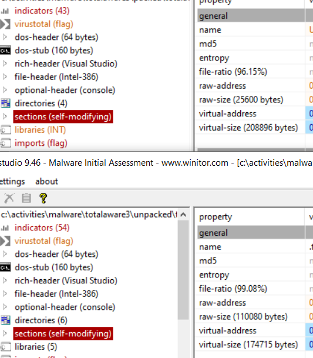

##### Unusual Naming Conventions
When it comes to naming conventions for sections and functions within a binary, often these can be a big giveaway if the binary is malicious. Often, malware authors will used random and obscure names (sometimes just a randomised alpha-numeric string) that will be an immediate cause for suspicion. The below screenshot shows two oddly named sections that are not commonly seen in a normal Windows executable.

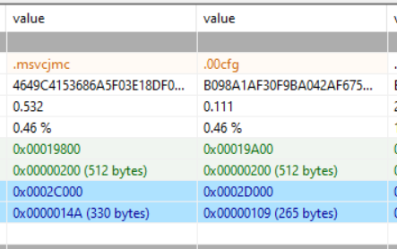


For the following analysis, a PE binary named Trickbot (zYERS.exe) will be used for each aspect of the process to ensure continuity of the guide.

### Static Analysis

##### Hashing
Before anything else, it is essential to grab some hashes of the suspicious binary. This can be done a number of ways, one reliable way is to use the ```Get-FileHash``` function of **Powershell**.
```posh
# It's always preferable to take a couple of hashes
Get-FileHash C:\Malware\zYERS.exe -Algorithm MD5
Get-FileHash C:\Malware\zYERS.exe -Algorithm SHA1
```

After grabbing some hashes using standard hashing algorithm, it is time to use a tool named **ssdeep**. Ssdeep employs a technique known as **Context Triggered Piecewise Hashing** (colloquially known as Fuzzy Hashing). The main difference between a regular hash algorithm and fuzzy hashing, is that fuzzy hashing is great at detecting modified versions of essentially the same binary. Usage is as follows:

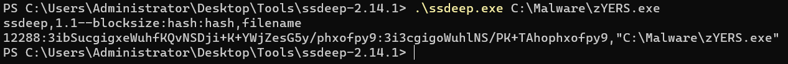

##### Binary Type
It's important to know what kind of binary you are dealing with. The **file** command in Linux is great for this. Since this lab doesn't have a Linux machine in it, WSL hosted Ubuntu machine will be used.
```bash
# cd to the C:\ directory via /mnt in your WSL Ubuntu machine, followed by the location of your binary.
cd /mnt/c/Malware
file ./zYERS.exe
```

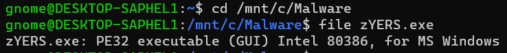

##### VirusTotal
Using VirusTotal and one of the hashes taken in the previous step, a search can be done using the hash to see if any of the various AV solutions VirusTotal uses has this binary in its database of known malware.

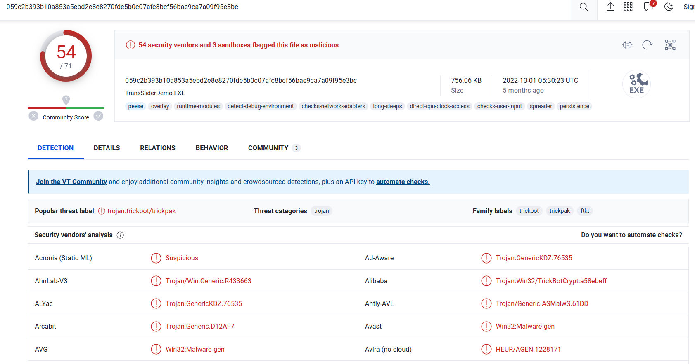

VirusTotal provides great information such as the threat category, the family label, the exact label used by the various AV solutions that have detected this particular binary as malware, and the community section often has great writeups and analysis about the malware.

##### PEStudio
PEStudo is a great tool for statically analysis a PE file. It provides a large amount of useful information in a very easy to navigate GUI interface. Some of the information it provides includes:
###### Basic Information about the binary

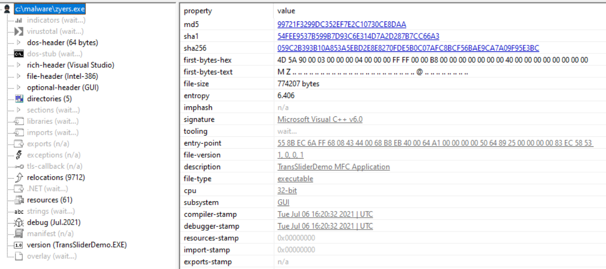

###### Dosheader

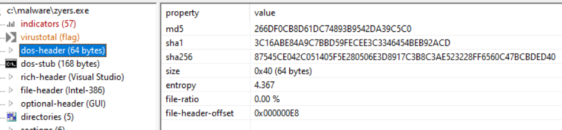

###### Sections

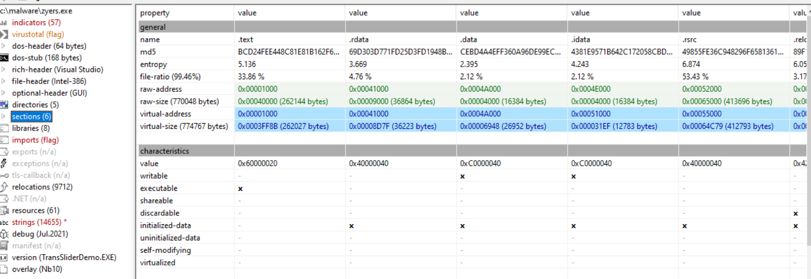

###### Libraries

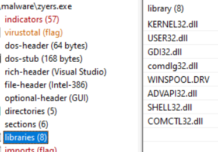

###### Imports/Exports (if present)

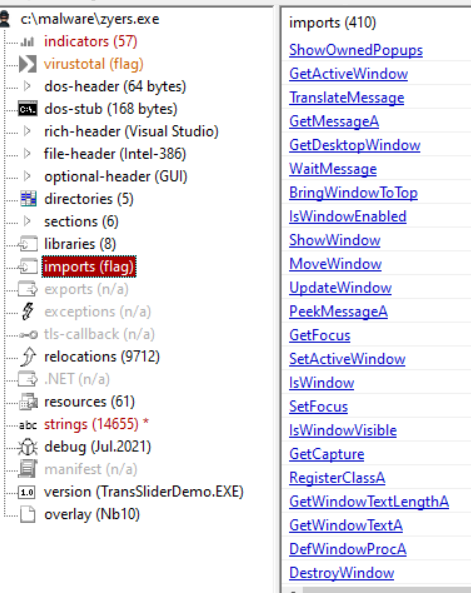

###### Strings

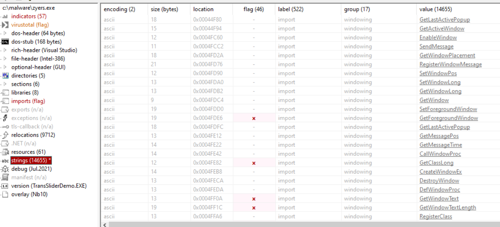

###### Version Information

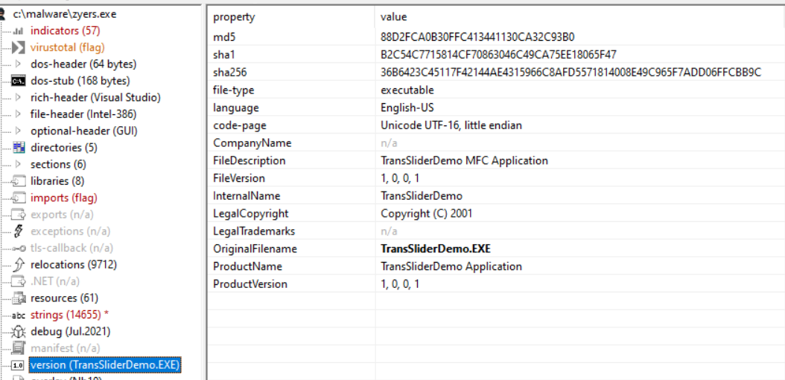

All of this information is incredibly useful when performing static analysis on a Windows PE.

### Dynamic Analysis

### Additional Malware Triage Guides

##### Yara Rules
Yara rules are a tool that allow you to scan and detect malware based on patterns seen in known previously analysed malware. They are particularly effective due to them being relatively easy to create and modify. Yara rules are also fairly lightweight, meaning they are easy to implement as a real-time protection method. The typical structure of a Yara rule looks something like the following:
```yara
rule ExampleRule
{
	meta:
		Author = "D0nkeyk0ng787"
		Date = "25/03/2023"
		Description = "This is a Yara rule"
		MD5 = "1234567890asdfghjklqwertymvddpob"
	strings:
		$standardString = "C:\\File\\Path\\Found\\With\\Strings.txt"
		$unicodeString = "http://www.c2domain.com/c2" wide
	condition:
		all of them
}
```

There are a few things to note about the above rule:
* Backslashes needs to be escaped. In the above example, the original path would obviously be ```C:\File\Path\Found\With\Strings.txt```, however, it is necessary to escape each backslash as has been done in the example above.
* When dealing with strings that you wish to be interpreted as unicode, adding the term **wide** after the string will ensure this. This is necessary for url paths such as the one in the example above.

Applying this to a real binary like the Trickbot binary analysed above requires a little bit of information which can be gained by doing static analysis on said binary. In this case, we have an MD5 and a SHA256 hash of the binary and 3 strings found in the binary. Combining all of this into a Yara rule and we get something like this:
```yara
rule TrickBot
{
	meta:
		Author = "D0nkeyk0ng787"
		Date = "25/03/2023"
		Version = "1.0"
		MD5 = "99721F3299DC352EF7E2C10730CE8DAA"
		SHA256 = "059C2B393B10A853A5EBD2E8E8270FDE5B0C07AFC8BCF56BAE9CA7A09F95E3BC"
	strings:
		$s1 = "TransSliderDemo MFC Application"
		$s2 = "TransSliderDemo.pdb"
		$s3 = "TransSliderDemo.EXE"
	condition:
		all of them
}
```

When run agaisnt a directory that contains Trickbot, it detects it.

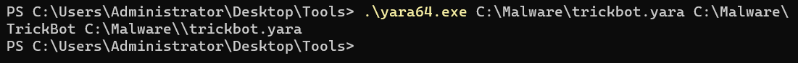

