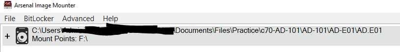

# Playbook

### Description

The following is a high-level overview of my process for forensically analysis as it relates to Windows and Linux systems, Memory images and Network captures.

##### Get-FileHash/md5sum/sha256sum
For every image/dump/pcap you have, the first thing you should do is get the file hash.
```posh
# In Windows
# Get the MD5 hash
Get-FileHash image01.E01 -Algorithm MD5
# Get the SHA256 hash
Get-FileHash image01.E01
```

```bash
# In Linux
# Get the MD5 hash
md5sum image01.E01
# Get the SHA256 hash
sha256sum image01.E01
```

### Windows Forensics

##### Forensic Toolkits
If using a forensic toolkit such as FTK, AXIOM, etc, it would be preferable to start ingesting your image straight away and then do the remaining steps as it ingests.

##### Arsenal Image Mounter
Using Arsenal Image Mounter, mount the image file, using default options. (Note: If prompted to turn the disk online, ensure you hit Yes.)



##### KAPE
KAPE usage is pretty straight forward, the following command will run the **KapeTriage** target option which will extract pretty much all the necessary parts of the image you will need. Then it will execute the **!EZParser** module which will run all of Eric Zimmermans parsers against the relevant artefacts from your extracted files. It will output the results from the various EZTools in csv format. 
```posh
# NOTE: You will need to adjust the --tsource to the drive where Arsenal Image mounter mounted your image. --tdest needs to be changed to where you want the files extracted by KAPE to be put. --mdest will also need to be changed to where you want the csv files generated by !EZParser to be put. THis should be a seperate, empty directory from the extracted files.
.\kape.exe --tsource F: --tdest C:\Users\Administrator\Documents\Files\Practice\Playbook-Files --tflush --target KapeTriage --zip Extracted --mdest C:\Users\Administrator\Documents\Files\Practice\Playbook-Files\Modules --mflush --module !EZParser --mef csv --gui
# Lastly, as an additional note, if you have FTK open, then you will need to add --ifw to the end of your command to ignore the FTK warning.
```

##### Finding Artefacts
My Windows forensics artefacts and writeups can be found [on my github page.](https://github.com/d0nkeyk0ng787/thmwriteups/tree/main/DFIR/Windows-Forensics)

The following is a brief, high-level overview of one processes you could follow to conduct your investigation. 
* Baseline the system - Start by collecting information about the system such as the hostname, timezone, users, network information.
* File and Program Evidence - Finding things like file/program execution, access, etc. EZTools such as Shellbag Explorer, Prefect Explorer, Amcache Parser, and MFT Explorer are great for finding this information.
* Browser - Browser artefacts can be extracted by opening the relevant database file in something like DB Browser for SQLite.exe and browsing through the entries.
* SRUM Database - The System Resource Usage Monitor database is another useful place to search for evidence of execution. It can be parsed with another EZ tool named Srum Explorer.

### Linux Forensics

##### Finding Artefacts
A list of various artefacts to look for in a linux image can be found [on my github page.](https://github.com/d0nkeyk0ng787/thmwriteups/tree/main/DFIR/Linux-Forensics)

##### Mounting Image Files
Mounting linux image files in another linux system is extremely useful, as it allows you to search through the file system like any other linux system to which you might have access. A guide for mounting linux images in the formats of **DD** and **EWF** can be found [on my github page.](https://github.com/d0nkeyk0ng787/thmwriteups/blob/main/DFIR/Linux-Forensics/mountingimagefiles.md)

##### Sleuthkit Timeline


### Memory Forensics

##### Finding Artefacts
My memory forensics artefacts list and tool usage can be found [on my github page.](https://github.com/d0nkeyk0ng787/thmwriteups/blob/main/DFIR/Memory-Forensics/CTF%20Writeups/THM/DFIR/Memory%20Forensics.md)

That page pretty much covers everything you are looking for. In general terms, you want to look for suspicious processes, evidence of malware, updates to the registry that weren't yet written to disk, recently executed commands.

### Network Forensics

##### NetMiner
NetworkMiner is the perfect tool to extract baseline information about the various hosts captured in your pcap. NetworkMiner can be run using mono like so:
```bash
mono NetworkMiner.exe
# For ease of use it's worth making an alias for this command. Mine is:
netmine
```

##### Suricata
Suricata will analyse your pcap against a large community database of rules written to detect known malware variants. If it detects traffic that has IOCs corresponding to known malware variants, it will return information such as the C2 IP and port, domains, and the variant name. Usage is as follows:
```bash
suricata -c /etc/suricata/suricata.yaml -r capture.pcap
# I suggest making an alias for suricata aswell. I can run suricata like so:
suricat capture.pcap
```
This will produce 4 files, the only one you will really need is ```fast.log```.

##### Wireshark
Not much too say here. If you need more information then the above 2 tools provide, you can analyse the pcap one packet at a time. It is always useful to export any objects from the pcap. If there are any executables or dll files I will hash them and then run that hash through virus total. Depending on the environment you are in and if it is permissible or not, it is useful to run the executable/dll through hybrid analysis with network simulation on and see if there are any additional IP/domains, etc that you can get from the binary. 

##### Other Useful Tools
* [Hybrid Analysis](https://www.hybrid-analysis.com/) - As stated above, useful for dynamic analysis and potentially finding more IP and domains to search for in your pcap.
* [Alienvault OTX](https://otx.alienvault.com/) - Useful for verifying a IP/domain and if it is malicious or not.


